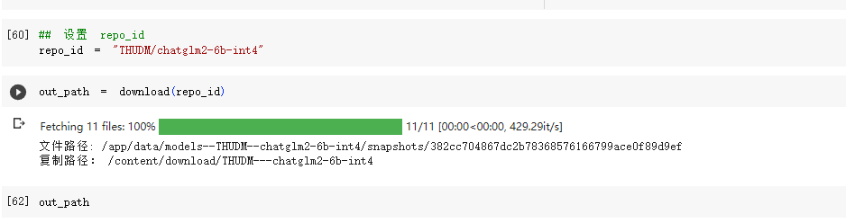
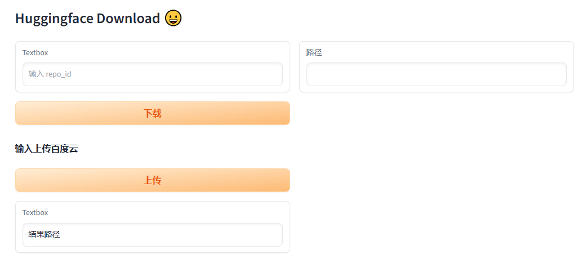

# HuggingfaceDownloadShare
中国如何下载huggingface 模型并共享链接

目前国内大模型的下载很慢。

有两种办法：
    1. 对于一些主流的模型可以通过 
    [aliendao](https://aliendao.cn/models) 进行加速。缺点是模型不多
    2. 如果你有梯子，那么可以直接下载。但几个G，甚至几十个G的模型，还是肉疼的。

为此采取一种曲线救国的方式（前提是你可以访问外网，主要为了节约流量）：
1. colab or [play-with-dcoker](https://labs.play-with-docker.com/)
2. 申请百度网盘开发者，上传百度网盘，然后国内下载。
    （上传速度很快）


## 方法一 (colab-推荐)

[colab 页面](https://colab.research.google.com/drive/1S7E3mMsVhJlhuvtMFUalOSXl0e0YOSbt?usp=sharing)




## 方法二 (play-with-dcoker)

```
docker pull mengkevin/gradio_hg:latest

docker run -it mengkevin/gradio_hg:latest
```

