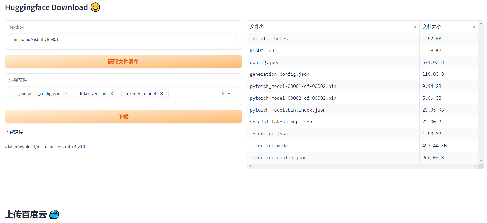

### 🎙️ Note：目前国内可以通过 [https://hf-mirror.com/](https://hf-mirror.com/) 访问huggingface, 模型数据很全，官网有具体使用方法


-----------------
# HuggingfaceDownloadShare
中国如何下载huggingface 模型并共享链接

目前国内大模型的下载很慢。

#### 现状
1. 对于一些主流的模型可以通过 
[aliendao](https://aliendao.cn/models) 进行加速。缺点是模型不多
2. 如果你有梯子，那么可以直接下载。但几个G，甚至几十个G的模型，还是肉疼的。

#### 曲线救国 
为此采取一种曲线救国的方式（前提是你可以访问外网，主要为了节约流量）：
1. colab or [play-with-dcoker](https://labs.play-with-docker.com/)
2. 申请百度网盘开发者，上传百度网盘，然后国内下载。
    （上传速度很快）

## 更新记录
- 2023-11-20  支持选择文件下载


### 共享机制
如果你愿意分享 你的百度网盘地址，可提交 issue 

在这个页面[共享模型](https://github.com/kevin-meng/HuggingfaceDownloadShare/issues/1)


## 方法一 (colab-推荐)

[colab 页面](https://colab.research.google.com/drive/1S7E3mMsVhJlhuvtMFUalOSXl0e0YOSbt?usp=sharing)


## 方法二 (play-with-dcoker)

```
bash run.sh
```

## 其他
如果模型特别大，建议直接使用 AWS 的 [EC2](https://signin.aws.amazon.com/)，按时付费，用完即关。

